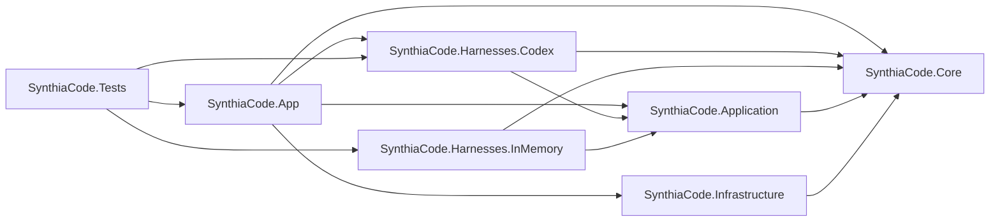
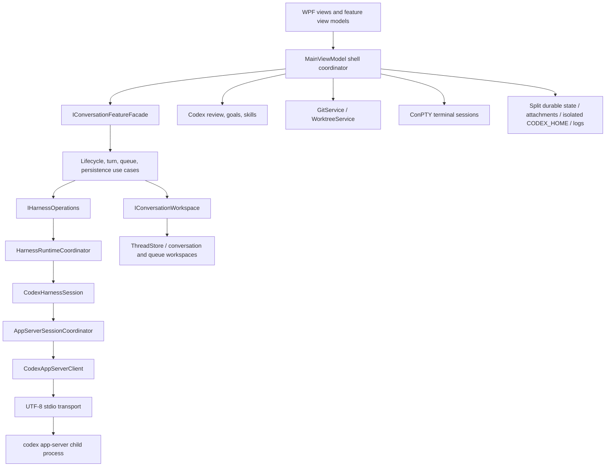
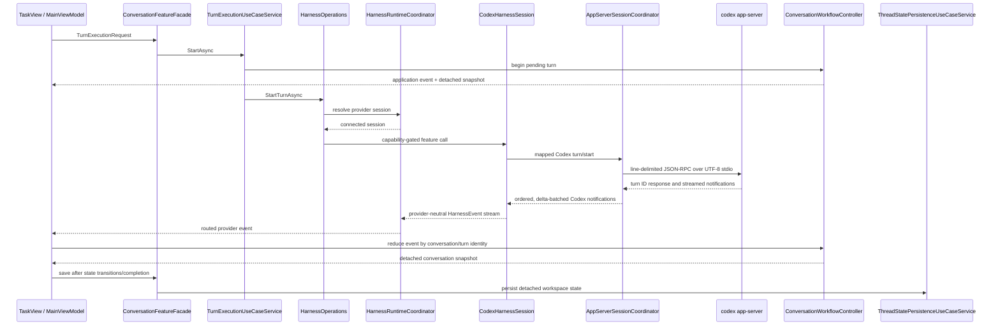
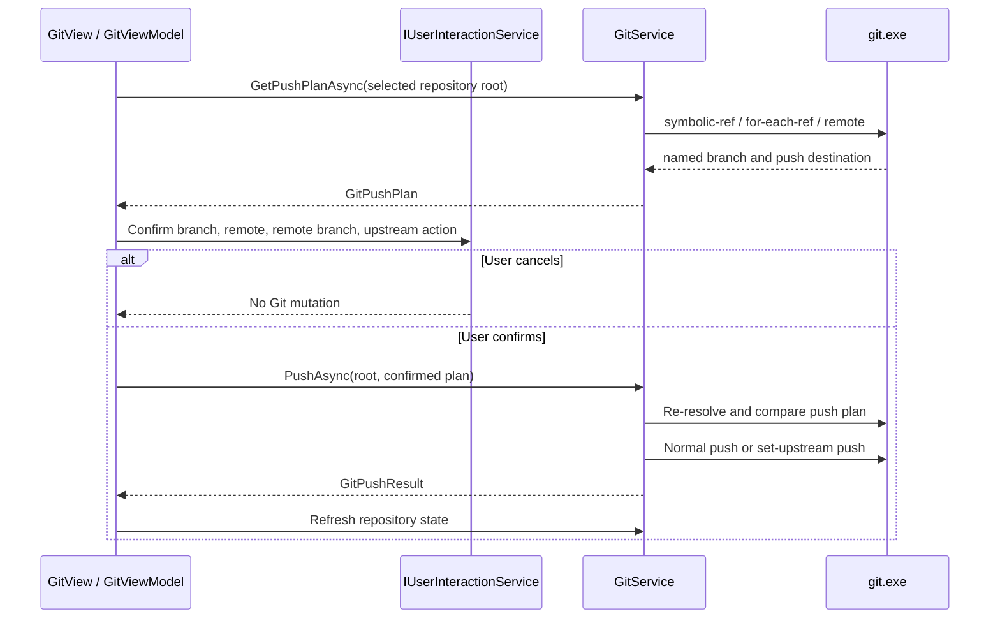

# SynthiaCode: Current Architecture

**Recorded:** 8 August 2026
**Last code-verified:** 8 August 2026
**Release:** 0.1.0
**Phase:** Architecture migration Phase 2, with durable state separated behind repository contracts
**Purpose:** Describe the current architecture, presentation shell, runtime and persistence boundaries, implemented desktop workflows, and release verification baseline.

## System shape

The solution is a Windows-only WPF desktop application with seven projects:

| Project | Responsibility | Dependencies |
| --- | --- | --- |
| `SynthiaCode.Core` | Provider-neutral harness models and events; settings, thread, attachment, Git, worktree, terminal, auth, logging, and Codex protocol-domain contracts; conversation reduction | None |
| `SynthiaCode.Application` | Harness registry and runtime; the conversation feature facade; workspace state ownership; thread lifecycle, turn execution, persistence, and queued-dispatch orchestration | Core |
| `SynthiaCode.Infrastructure` | Codex CLI/app-server transport, split JSON durable-state repositories and legacy import, Git, worktrees, ConPTY terminal, auth, logging | Core |
| `SynthiaCode.Harnesses.Codex` | Adapter from neutral harness commands/events to Codex app-server types, operations, and notifications | Application and Core |
| `SynthiaCode.Harnesses.InMemory` | Deterministic, process-free harness implementation used to prove and test the provider boundary | Application and Core |
| `SynthiaCode.App` | WPF composition root, windows, theme resources, feature view models, UI services, and Codex-specific side features such as review, goals, and skills | Application, Core, Codex harness, and Infrastructure |
| `SynthiaCode.Tests` | xUnit-discovered behavioral and integration-style test suite; the executable entry point remains only as a UTF-8 transport fixture | All production projects plus the in-memory harness |

The actual project-reference graph is:



`AppServices.Create()` is the manual composition root. It constructs concrete infrastructure, wraps `SplitJsonSettingsStore` in `CoalescingSettingsStore`, registers the production `CodexHarness`, creates one `ConversationFeatureFacade`, and supplies that facade to `MainViewModel`. `SynthiaCode.Harnesses.InMemory` is referenced by tests but is not registered in the production app. There is no external dependency-injection container.

The architecture is layered but deliberately pragmatic rather than a strict clean-architecture implementation. Core has no project dependencies. Application contains the portable harness runtime and the complete conversation feature slice. Infrastructure contains operating-system and process adapters. Provider translation lives in a harness project. App owns WPF and intentionally retains Codex-specific side features until portable contracts exist for them.

At runtime the major components form this topology:



## Startup and shutdown

1. `App.OnStartup` enforces a single process with a named mutex.
2. `AppServices.Create` creates settings, Codex, auth, Git, worktree, terminal, theme, picker, interaction, and logging services, then registers the Codex harness and its session runtime.
3. `MainWindow` is constructed and shown before asynchronous initialization begins.
4. `MainViewModel.InitializeAsync` loads settings, restores shell preferences, applies the theme, restores recent-project metadata, and runs Codex/auth diagnostics.
5. App-server warm-up starts in the background after the shell reaches Ready.
6. Window closing calls `MainViewModel.ShutdownAsync`, which cancels active turns, disposes terminal and task resources, clears approvals, disposes skills and the conversation facade, disposes harness sessions and the app-server client, and saves the active thread state.
7. `App.OnExit` performs a final idempotent disposal and releases the mutex.

This ordering deliberately keeps shell visibility independent of Codex app-server startup.

## Presentation ownership

`MainViewModel` is the shell coordinator. `ProjectThreadViewModel`, `TaskViewModel`, `TerminalViewModel`, `DiagnosticsViewModel`, `AccountViewModel`, `GitViewModel`, `SkillsViewModel`, and `EffectiveCodexSettingsViewModel` own feature presentation state and commands. The shell supplies explicit operation delegates or immutable-on-read context callbacks and receives status/selection callbacks; feature view models do not reference or control one another.

App-server lifecycle is exposed to presentation through `IAppServerSessionCoordinator`. Its implementation owns `CodexAppServerClient`, process transport startup, reconnect serialization, batched notifications, typed app-server operations, health transitions, and disposal. It also implements the narrow Codex backend consumed by `CodexHarnessSession` and separate Codex-only feature interfaces for account, execution policy, skills, configuration, goals, reviews, and approvals. Protocol request/response JSON and delta-payload batching remain in the Codex Core/Infrastructure boundary rather than WPF presentation.

`App.xaml` is now a resource-composition root. Theme colors live in matching light, graphite-dark, and system-color high-contrast dictionaries; foundations, typography, vector icons, buttons, inputs, navigation, and transient controls are split by concern. Feature views consume semantic dynamic resources, so changing theme dictionaries does not recreate the window or any feature view model.

`MainWindow.xaml` uses `WindowChrome` and native `SystemCommands` for dragging, system-menu, minimize, maximize/restore, close, resize, and Windows 11 maximize-button hit testing. Its primary layout is no longer a workspace `TabControl`: the project rail, conversation, lower terminal dock, and changes/settings inspector are composed simultaneously. At compact widths the rail and inspector become mutually exclusive drawers behind a scrim; the approval host remains at the highest application-owned z-order. `Esc` dismisses the active side drawer but never dismisses UI behind a pending approval.

`MainViewModel.UpdateViewportWidth` projects exclusive compact (800–1099 px), medium (1100–1439 px), and wide (1440 px and above) shell states. The rail is persistent in medium/wide states, the inspector is persistent only when enabled in wide state, and the terminal remains a bounded lower row unless maximized within the center workspace. Existing persisted open/closed preferences remain the source of truth.

Feature controls bind directly to their existing feature view models. Timeline, raw-event, thread, diagnostic, recent-project, and changed-file lists use recycling virtualization and content scrolling. The transcript keeps pixel scrolling for variable-height turns and uses a dedicated 72 px near-latest coordinator that pauses following after deliberate upward navigation and resets follow state when chat identity changes; terminal output remains coalesced through the existing 50 ms presentation path.

`ProjectThreadViewModel` also owns the unified project/thread navigation projection. `ProjectNavigationItemViewModel` groups presentation threads by normalized primary project path, tracks project disclosure and running summaries, and preserves the existing active-project `Threads` collection as a compatibility surface. `RecentProject.Path` remains the primary-folder identity while an optional persisted secondary-folder collection supplies a normalized primary-first root set; legacy single-folder records remain valid.

`ProjectThreadView` renders project-name disclosure rows with their project-scoped threads and empty state; filesystem paths are retained for routing but omitted from the navigation UI. A project-row `+` creates a current-checkout thread immediately; isolated worktree creation and Edit project folders are retained in the project's advanced menu. The native folder editor adds/removes secondary roots and changes the primary only while that project's chats are idle. Only the selected project is expanded automatically. Selecting an existing project refreshes its recent timestamp in place rather than reordering the hierarchy. Completed and idle thread pills are intentionally suppressed; running, failed, cancelled, and archived states remain visible. Selected-thread lifecycle operations are exposed through high-contrast contextual action buttons and fully theme-aware context-menu surfaces. The workspace heading above Task and Changes contains only the selected thread title.

Projectless General chats use the same thread lifecycle, transcript, search, pin/archive, rename, and persistence paths without inventing a filesystem CWD. Sidebar chat management and cross-chat search operate on the persisted thread projection, while find-in-chat remains scoped to the selected transcript. User prompts can be copied directly, edited with rollback of later turns, or used as stable fork points; all three actions preserve the original submitted text in turn history.

`UserAccountView` is anchored in an `Auto` row below the independently scrolling project list. Its upward-opening flyout presents the ChatGPT email-derived identity, plan, remaining rate-limit windows, reset times, optional credits, Settings, and authentication actions. `AccountViewModel` reads typed `account/read` and `account/rateLimits/read` results, consumes account notifications before thread routing, keeps account data in memory only, and treats refresh failures as nonfatal. The app-server does not currently expose an authoritative display name or avatar, so the UI uses the email local part and generated initials.

`MainViewModel.cs` remains the shell coordinator. It owns UI validation, project/thread selection, cross-feature event routing, shell layout, theme/status projection, app-server warm-up, notification marshaling, and shutdown ordering.

Application workflows no longer use `MainViewModel` as a hidden service layer. The complete slice lives under `SynthiaCode.Application/Conversations`:

- `ThreadLifecycleUseCaseService` owns durable create, resume/fallback, fork, archive, rename, delete, pin, and worktree transitions;
- `TurnExecutionUseCaseService` owns start, edit/rollback, steer, cancel, automatic-title, and conversation state transitions;
- `FollowUpQueueUseCaseService` owns queue mutation, durable queue snapshots, per-thread serialized dispatch, recovery, removal, and disposal;
- `ThreadStatePersistenceUseCaseService` owns bounded transcript and active-thread snapshots;
- `ConversationWorkflowController` implements the single `IConversationWorkspace` state owner, serializes reductions, preserves terminal lifecycle ordering, routes notifications, and returns detached snapshots;
- `ConversationFeatureFacade` is the one presentation-facing boundary that composes and hides those services.

`MainViewModel` receives one `IConversationFeatureFacade`, composes resolved request inputs, subscribes to application workspace events, and projects returned or current authoritative snapshots into feature view models. Use-case request records no longer carry UI callbacks. `CodeReviewUseCaseService` remains an App-side Codex feature and uses `IConversationWorkspace`; goals and skills remain separate Codex side surfaces as planned.

## Runtime flows

### Harness provider boundary

The harness boundary separates portable conversation behavior from Codex protocol details:

- `ConversationAddress` gives every conversation a stable local UUID, a normalized harness ID, and an optional provider-owned remote ID. Persistence stores all three and migrates legacy Codex-only thread records on load.
- `HarnessDescriptor` advertises a bit-set of capabilities. A session registers typed common features such as create/resume/read conversation, rename/archive/fork/rollback, turn start/cancel/steer, and model catalog. `HarnessOperations` checks the advertised capability before resolving a feature, so an unsupported action fails at the application boundary rather than inside a provider. Approval records exist in the neutral contract, but the production approval workflow is still carried by the Codex-only side interface.
- `HarnessRegistry` rejects duplicate provider IDs. `HarnessRuntimeCoordinator` probes and lazily connects at most one session per harness ID, forwards neutral events, serializes connection creation, and owns session disposal.
- `CodexHarness` detects the CLI, asks the shared app-server coordinator to connect, maps neutral commands into Codex request records, and translates general notifications into `HarnessEvent` records. Provider JSON and Codex request types stop at this adapter/backend boundary for portable conversation operations.
- `InMemoryHarness` implements the same common feature set without processes or persistence. It is a deterministic contract and workflow test double, not a production fallback.

The portability work is intentionally incremental. Common conversation execution now travels through neutral commands and events, but `CodexThreadWorkspace`, `CodexThreadService`, and persisted transcript DTOs retain Codex-era names and shapes. Codex-only features still use narrow side interfaces on `IAppServerSessionCoordinator`; they are not advertised as portable harness capabilities until another provider can supply equivalent semantics.

### Codex task



Protocol request construction, response correlation, parsing, and transport failure handling remain inside Infrastructure. Core owns app-server request/result records and notification-derived thread state.

The presentation layer subscribes to both event levels for different reasons. General thread/turn text, activity, context, diff, and completion updates travel through `CodexHarnessEventTranslator` and `HarnessRuntimeCoordinator` to `MainViewModel`. Raw Codex notifications are consumed directly only by provider-specific account, goal, approval-resolution, skills-invalidation, and review-lifecycle surfaces. This split prevents protocol types from leaking into portable conversation operations while preserving Codex features that have no neutral contract.

### State ownership

| State | Authoritative owner | Notes |
| --- | --- | --- |
| Saved projects, preferences, drafts, local transcript cache | `AppSettings` through `ISettingsStore` | One durable graph is snapshotted before coalesced atomic writes. |
| Persisted/presentation thread mapping and active selection per scope | `ThreadStore` | Maps storage-only DTOs to observable clones and back. |
| Conversation workspace state | `ConversationWorkflowController` through `IConversationWorkspace` | Single Application owner for loaded/running identity, active-turn routing, serialized reduction, terminal ordering, and detached snapshots; it is not the durable store. |
| Reduced transcript, activity, context usage, generated images, and latest diff | `IConversationWorkspace`, backed by one `CodexThreadService` per thread | Events route by remote thread and turn IDs; bounded collections prevent unbounded repeatable history. |
| Queued follow-ups | Application conversation slice, backed by one `CodexFollowUpQueue` per thread | Queue mutation and dispatch are isolated from whichever thread is selected in the UI and exposed through the facade. |
| Remote Codex thread history and goals | `codex app-server` | Local state is a durable presentation/recovery cache and is reconciled on resume/read. |
| Repository and terminal state | Git processes and per-thread ConPTY sessions | Presentation keeps repository projections, transient confirmed push plans, and bounded terminal buffers, not an independent source of truth. |

Snapshots crossing from workflow/reducer code into presentation are cloned and read-only by convention. Background notifications and queued dispatch route by captured thread identity, never by the currently selected chat.

### Dedicated code review

The composer **Review** action and an exact `/review` submission share one native target picker. `GitService` validates the selected repository and supplies stable branch and recent-commit choices; the picker also exposes uncommitted changes and custom instructions. `CodeReviewUseCaseService` creates the pending turn, sends typed inline `review/start` through the existing app-server coordinator, requires the returned `reviewThreadId` to match the current chat, and binds the returned turn ID.

`enteredReviewMode` and `exitedReviewMode` are routed as protocol-specific lifecycle items so their review scope and final Markdown findings are not lost through the harness-neutral activity projection. `CodexThreadService` labels the turn as a code review, persists its scope and response, and restores the same state from app-server history. The existing turn-completion and cancellation paths remain authoritative.

`CodexReviewFindingParser` derives immutable priority, body, file, line-range, and optional-confidence records from the persisted response. It accepts the current app-server plain-text formatter and the reviewer's documented structured JSON fallback, validates and bounds both forms, and keeps the raw transcript unchanged. `CodexReviewFindingProjection` selects only the latest non-superseded review in the active chat, so starting a newer review clears stale annotations and restored/forked chats need no duplicate finding persistence.

`GitUnifiedDiffParser` projects the selected raw diff into header, hunk, context, addition, removal, and metadata rows with old/new counters. It also extracts each `@@` section as an immutable, newline-normalized patch containing the file header and exactly one hunk. `GitViewModel` matches the latest findings to the selected repository and current/original file path, anchors each card to the last new-side row in its range with an old-side deletion fallback, and exposes valid unanchored findings separately. `GitView` renders recycling-virtualized rows, textual P0-P3 badges, accessible inline cards, and the unmatched fallback while retaining the raw diff property.

For ordinary tracked text modifications, Unstaged rows expose stage and confirmed discard while Staged rows expose unstage. `GitService` validates the bounded single-hunk patch and streams it directly to `git apply`: cached apply stages, cached reverse apply unstages, and worktree reverse apply discards. Repository status and the surviving selected file refresh through the existing mutation path. File-level metadata changes and binary diffs keep the established whole-file actions instead of presenting ambiguous partial operations.

The Changes comparison contract is typed as Unstaged, Staged, Commit, Branch, or Last turn. `GitService` resolves a selected revision to a commit before invoking `git show --root` for the exact commit or `git merge-base` plus `git diff <base> HEAD` for a branch. `GitUnifiedDiffDocumentParser` splits the aggregate output into immutable per-file documents, preserving rename context, and the existing line renderer consumes the selected document. Commit, Branch, and Last turn never satisfy file/hunk mutation command guards; repository-level push is governed independently by named-branch, selected-root, and busy-state guards.

Codex `turn/diff/updated` notifications translate into a harness-neutral turn-diff event. The thread reducer attaches the bounded aggregate diff to its exact turn, app-server history restores `turn.diff`, and detached snapshot mappings preserve it end to end. Persistence intentionally retains a diff only for the latest non-superseded turn; Last turn parses that snapshot and presents **All repos**, matching the official Codex scope without inventing repository ownership that is absent from the protocol payload.

User-authored inline comments are a separate typed Core contract. `GitInlineComment` bounds and validates stable identity, repository containment, current/original paths, old/new side, line, captured diff text, body, and timestamps. `GitViewModel` owns row-local add/cancel/edit/remove interactions, projects pending comments back onto exact rows after diff refreshes, and exposes a per-chat fallback summary for comments outside the selected file. `ComposerReviewCommentDraftStore` persists cloned comments alongside attachment drafts and preserves new-chat-to-thread migration. `GitInlineCommentPromptFormatter` produces the single deterministic prompt used by both the local transcript and harness command.

Start, steer, and queue flows capture immutable comment snapshots. Acknowledgement removes only those IDs from the originating chat's live or persisted draft; failures and comments created after capture remain pending. `CodexFollowUpQueue` deep-copies the structured comments through settings persistence, exposes their count on queued cards, and formats them only when manually steered or dispatched. Confidence display when the plain-text payload omits it and detached review delivery remain outside this slice.

### Native branch push

Native push follows the same selected-repository boundary as the Changes workspace while separating read-only target discovery from mutation. Core distinguishes detached state through `GitRepositoryState.IsDetachedHead` and `HasNamedBranch`, carries the confirmed destination in `GitPushPlan`, and returns `GitPushResult`. `IGitService.GetPushPlanAsync` supplies the exact branch, remote, remote ref, repository root, and upstream-creation flag that presentation must show before `IGitService.PushAsync` can mutate Git.



`GitService.GetPushPlanAsync` requires a detected repository root, a symbolic named branch, and at least one commit. An existing upstream is read with `for-each-ref` and retains both its configured remote and remote branch. Without an upstream, `git remote` must return exactly one remote: none produces an actionable configuration error, while multiple remotes fail closed rather than guessing. The sole remote produces a plan whose `CreatesUpstream` flag is true. Slash-containing branch names remain individual `ArgumentList` values throughout.

`GitViewModel` captures the selected repository root, enters the shared busy state, obtains the plan, and verifies that its root and branch still match the displayed repository. `WpfUserInteractionService` then presents an explicit default-No confirmation naming the local branch, remote, remote branch, and whether upstream will be created. Cancellation returns before `PushAsync`; confirmation is followed by a second displayed-target check. `GitView` exposes this command as **Push** beside the existing commit controls, and detached `HEAD` never satisfies its command guard.

`GitService.PushAsync` requires the confirmed repository root to match the request, recomputes the current plan, and rejects any branch, remote, remote-ref, or upstream-mode change after confirmation. Existing upstreams use the argument vector `push -- <remote> HEAD:<remote-ref>`; a first push uses `push --set-upstream -- <remote> <branch>`. Neither path adds force or delete options. Success returns the typed result and refreshes every repository projection while preserving the selected root. Push stderr is classified into sanitized rejection, authentication, missing-repository, connectivity, or generic guidance; raw remote output is not added to presentation or structured logs, and credential storage remains owned by the user's Git configuration.

Pull-request creation/status, remote selection and management, fetch, and pull remain outside the native Git surface.

### Server-request approvals and permission modes

`CodexAppServerClient` classifies app-server messages as outgoing responses, notifications, or incoming server requests. Incoming request IDs retain their integer or string representation. Command-execution, file-change, and permission requests are parsed to typed Core models; malformed and unsupported requests receive deterministic JSON-RPC errors so the server is never left waiting. The client maintains separate outgoing and incoming registries and permits exactly one successful response for each incoming request.

`AppServerSessionCoordinator` attaches request handlers to the active client generation and rejects responses from a replaced connection. `MainViewModel` marshals requests to the captured UI context and owns `ApprovalQueueViewModel`, which serializes prompts globally. `serverRequest/resolved`, reconnect, and shutdown events invalidate stale prompts. Permission responses are constructed by intersecting the selected top-level permission groups with the immutable original request.

`ExecutionPolicyViewModel` owns the three user-facing permission modes and delegates their exact mapping to `CodexPermissionModeResolver`. Ask for approval and Approve for me share the `:workspace` permission profile and `on-request` policy; their reviewers are `user` and `auto_review`, respectively. Custom omits all boundary/policy/reviewer overrides for the configured default or sends only a selected named profile. `permissionProfile/list` is scoped to the project working directory, paginated, deduplicated in server order, and guarded against stale app-server generations. Method-not-found becomes an explicit legacy capability state, where Ask uses `workspace-write` with the same policy and reviewer.

Settings persist the mode and optional profile ID through `AppSettingsPermissionMigration`. Existing workspace-write/on-request settings migrate to Ask, explicit inheritance migrates to Custom, and nonstandard legacy combinations remain a distinct compatibility state without broadening access. `config/read` and `configRequirements/read` supply effective and managed context; reviewer and profile restrictions are enforced alongside legacy sandbox/policy restrictions. Unknown modes, stale profiles, and disallowed selections fail closed. The single resolved result is passed consistently to thread start, resume, fork, replacement-thread, and every turn-start request, and the client rejects any request that combines a permission profile with a legacy sandbox before writing to transport.

### Shared Codex configuration and provenance

`SharedCodexConfigurationService` owns the two editable files in the isolated runtime home: `AGENTS.md` and `config.toml`. It reads strict UTF-8 up to 512 KiB, fingerprints loaded bytes with SHA-256, rejects stale revisions, writes a same-directory temporary file through to disk, and atomically replaces the destination. Missing shared files are materialized only for an explicit save or external-editor action. File contents never enter structured logs.

For the active workspace, the service locates the nearest Git root and enumerates existing `AGENTS.md` and `.codex/config.toml` files from root to leaf after the two shared sources. `CodexConfigurationViewModel` keeps dirty editor text during automatic Settings refresh, exposes explicit refresh/save conflict recovery, and supplies Editor/Explorer commands for every provenance record. Project-owned sources are provenance-only in the built-in editor and deep-link to the user's external tools.

### Skills and effective Codex settings

Phase 6A reuses the initialized `AppServerSessionCoordinator`; it does not create another process, transport, client, or settings store. Infrastructure owns typed serialization and tolerant parsing for `skills/list`, `skills/config/write`, and a separate allowlisted `config/read` projection. A `-32601` response becomes an unsupported-capability result and leaves the shared app-server connection healthy.

`SkillsViewModel` resolves the same active General, project, or worktree CWD used for task execution. Absolute normalized `SKILL.md` paths are row identity, so duplicate names remain distinct. The source collection retains valid rows when the same CWD reports load errors; search and scope filtering project that source into a recycling-virtualized list. Enable/disable sends only path and desired state, applies the returned `effectiveEnabled`, then forces discovery to reconcile the complete row.

`skills/changed` is an invalidation signal rather than row data. The view model debounces it, refreshes only while Settings is active, and otherwise marks the cache stale. Refresh generations and cancellation prevent an older CWD from replacing a newer context. The shell marks both Skills and effective settings stale when the active context changes and disposes the Skills notification subscription before the shared coordinator shuts down.

`EffectiveCodexSettingsViewModel` presents model, provider, reasoning effort, service tier, profile, sandbox mode, approval policy/reviewer, web search, and workspace network access with available origin labels. Infrastructure discards every other configuration field before constructing the Core result, so raw JSON, MCP headers, environment values, and secrets never enter presentation state or application logs. This read-only overview coexists with the existing explicit shared-file editor, model selectors, and permission resolver.

```text
app-server request (method + id)
  -> CodexAppServerClient typed parser and incoming registry
  -> AppServerSessionCoordinator active-generation check
  -> MainViewModel UI-context dispatch
  -> ApprovalQueueViewModel / ApprovalPromptView
  -> selected decision or permission subset
  -> coordinator generation check
  -> client exact-once JSON response with original id type
```

High-frequency agent-message deltas are grouped by thread, turn, and item before UI dispatch. Any non-delta event first flushes pending text, which preserves ordering for completion, error, tool, and lifecycle notifications. Idle deltas flush on the batching timer so streaming remains visibly progressive.

### Multi-turn conversation state

`CodexThreadWorkspace` owns one `CodexThreadService` per app-server thread and a turn-to-thread routing index. Each service exposes a bounded chronological collection of `CodexConversationTurn` objects. A turn owns its user prompt, assistant response, activity collection, status, and start/completion timestamps; the older singular final-response and timeline properties remain compatibility projections.

Submitting a follow-up calls `turn/start` with the existing thread ID. A pending local turn is created immediately, then bound to the returned app-server turn ID. Binding and notification reduction share a state gate and reconcile an already-observed turn, so notifications that arrive before the request response do not create duplicate turns or lose the response.

Thread selection and resume use typed `thread/read`/resume results with `includeTurns: true`. Canonical app-server user and assistant messages are reconciled with local turn snapshots, while richer local activity remains attached to its matching turn. If the server cannot provide history, the local snapshot remains usable. Legacy records containing only a preview and final response synthesize one visible completed turn.

`TaskView` presents the collection as a recycling-virtualized chronological transcript. Each turn has a distinct outer boundary, a user-message surface, and an assistant-message surface whose activity expander precedes the final answer, so related work and outcome share one card while adjacent turns remain visually independent. Dedicated review turns add a non-color Code review label and scope above the same Markdown answer surface. The app-server stream is retained in bounded raw-event and diagnostic collections, while visible turn activity is an allowlisted projection of commentary, commands, file changes, tools, searches, plans, collaboration, review lifecycle, guidance, and actionable errors. Activity projection preserves complete user-facing detail, lists every reported changed path, and prefers structured web-search queries, page URLs, and find-in-page data over compatibility summaries. Stable item keys consolidate start, progress, and completion into one row; lifecycle, token, output-delta, reasoning, final-answer, and unknown notifications remain diagnostics-only. It follows live output while the viewport is near the bottom, exposes a Jump to latest action after manual scrolling, hides empty activity, collapses historical activity, wraps long detail without horizontal transcript overflow, and keeps the composer fixed. Assistant text uses the native Markdown renderer for common technical prose, nested lists, tables, footnotes, definitions, safe links/images/HTML, syntax-highlighted fenced code, and per-block copying; unsafe browser content remains visible and inert. Generated-image completion events are deduplicated into safe local previews and persist through restore and fork. The first action is labelled Run task; subsequent submissions are labelled Send follow-up. During an active turn, the same composer becomes the guidance input.

The composer footer owns one compact model summary instead of a permanent Run settings expander. Its anchored flyout drills into the authenticated model catalog and filters reasoning efforts from the selected model's advertised capabilities. Fast is a catalog-provided service tier rather than a model alias and is enabled only when the selected model advertises `fast`. `account/read.planType` is presentation context only; the visible `model/list` result is the effective capability source for ChatGPT and API-key sessions. Model, reasoning, and inherit/standard/fast preferences persist independently of account entitlements, are revalidated after catalog refresh, and are disabled while the selected turn is active.

### Multi-folder project roots

`RecentProjectService.UpdateProjectFolders` validates a distinct existing folder set before mutation, keeps the selected primary first, rejects collision with another saved project's primary, and migrates matching project-thread and composer-draft scopes in one settings update. Non-worktree chats move to the new primary; worktree chats retain their worktree directory. Legacy attachment references are stamped with their owning pre-migration root before paths change, and queued-turn root snapshots are refreshed.

Conversation start, resume, fork, and turn commands carry a harness-neutral workspace-root list. The Codex adapter keeps the effective primary/worktree as `cwd`, describes secondary folders as path data while preserving primary-only automatic `AGENTS.md`, skill, and `config.toml` discovery, and serializes the roots as `sandboxPolicy.writableRoots` only for explicit `workspaceWrite` turns. Read-only, unrestricted, config-owned, profile, approval, and managed-policy semantics are not broadened.

`GitViewModel` scans the active worktree plus attached project folders, deduplicates repositories by resolved root, keeps the effective primary first, and projects one selected repository into Unstaged, Staged, Commit, and Branch state. Last turn intentionally switches the header to **All repos**. Every Git mutation and Editor/Explorer deep link uses a selected repository root. File/hunk mutations remain available only in Unstaged or Staged, commit requires staged changes, and push requires the selected repository to retain a named branch through confirmation and execution.

### Attachments and generated-image editing

`AttachmentDraftOrchestrationService` coordinates picker, clipboard, drag/drop, draft, queue, and turn attachment state. `WorkspaceAttachmentResolver` accepts safe file and folder mentions contained by any attached project root, persists the deepest owning root, and rejects roots, sibling-prefix escapes, wildcards, alternate data streams, detached roots, and reparse escapes. `LocalAttachmentStore` imports external images, files, and deterministic folder snapshots into bounded managed storage without persisting their original external paths. Managed images serialize as `localImage`; managed files and folders serialize as `mention` inputs. Attachment schema v3 persists generic metadata while retaining legacy image compatibility.

Startup rehydrates managed attachment paths and performs reference-aware staging/orphan cleanup. Queued and background sends retain the owning workspace and immutable attachment/options snapshot. The generated-image viewer and editor reuse `LocalImageResourcePolicy`; edits can target the whole image or an exported marked region, with bounded drawing controls and a guide image supplied to image generation.

### Queued follow-ups

`CodexFollowUpQueueWorkspace` owns one `CodexFollowUpQueue` per app-server thread, parallel to `CodexThreadWorkspace`. The selected `TaskViewModel` binds to that thread's observable queue, while completion handling accesses queues by routed thread ID so thread A can dispatch safely while thread B remains selected and running.

During an active turn, the application-wide `FollowUpBehavior` setting chooses Queue or Steer as the primary composer action. Queue is the default; `Ctrl+Shift+Enter` and the adjacent alternate button invert the behavior for one message without changing the setting. Queue insertion is local and clears the composer only after the item is persisted. Steer continues to use `turn/steer` with the captured thread and expected turn IDs and clears text only after acknowledgement.

Each queue item has a stable ID, text, timestamps, a `Pending`, `Starting`, or `NeedsAttention` state, and a deep-copied turn-options snapshot. Queues enforce 50 items, 64 KiB per item, and 256 KiB aggregate text per thread. `AppSettingsSnapshot` and `ThreadStore` deep-copy the queue and nested options, and every enqueue, edit, reorder, delete, state transition, and acknowledgement is persisted through the coalescing settings store. A persisted `Starting` item restores as `NeedsAttention`; restored pending work is presented but never dispatched solely because startup found an idle thread.

Successful `turn/completed` reduction saves the owning transcript and calls the per-thread drain path. A semaphore serializes dispatch for that thread, then running state, head identity, and item state are checked again. The head is persisted as `Starting` before `turn/start`; it is removed only after the response acknowledges the new turn. A failed/cancelled completion does not drain, and start failures leave the head as `NeedsAttention` without automatic retry. Archive and assistant-owned worktree removal remain disabled until the queue is empty.

```text
active composer -> Queue -> per-thread queue -> immediate settings snapshot
turn/completed (Completed only)
  -> routed thread service save
  -> per-thread dispatch gate
  -> persist head as Starting
  -> turn/start with captured thread/workspace/options
  -> acknowledge and remove, or retain as NeedsAttention
```

Background dispatch validates that the captured workspace still exists and never reads the currently selected thread. Immediately before starting the queued turn it refreshes model availability, effective configuration, and managed permission requirements, then resolves the saved options against that current capability state. A refresh failure leaves the item in `NeedsAttention` rather than sending with stale assumptions.

### Terminal

```text
TerminalViewModel
  -> ITerminalService
  -> WindowsConPtyTerminalService
  -> PowerShell process
  -> OutputReceived events
  -> thread-safe per-thread circular character buffer
  -> one scheduled presentation per 50 ms batch
  -> captured SynchronizationContext
  -> TerminalOutput snapshot property
  -> WPF TextBox
```

Each terminal buffer is capped at 250,000 characters. Phase 5B replaced the original per-chunk dispatcher post and full-string recreation with a circular buffer and a coalesced 50 ms presentation path. Session-end telemetry records received chunks, characters, presentation updates, retained characters, and duration.

### Persistence

The composition root exposes a `CoalescingSettingsStore` around `SplitJsonSettingsStore`. Inside the Application conversation facade, thread transcript saves run through `ThreadStatePersistenceUseCaseService`, queued-follow-up saves run through `FollowUpQueueUseCaseService`, and lifecycle transactions persist through `ThreadLifecycleUseCaseService`. Shell preferences remain narrow `MainViewModel` saves. Requests arriving within 75 ms are collapsed into one logical aggregate snapshot; the split adapter then projects that unchanged `AppSettings` snapshot into focused repository documents.

Repository contracts for preferences, the project/thread catalog, conversations, queues, drafts, the commit manifest, and legacy settings belong to Core. Their JSON implementations belong to Infrastructure. `AppSettings`, `PersistedProjectThread`, and the presentation model did not change in Phase 2; `DurableStateMapper` is the anti-corruption boundary between the established in-memory graph and the new disk documents.

Each physical document carries schema version 1 and a monotonically increasing generation. Repositories write through a temporary file and retain the preceding primary as a backup. Preferences, catalog, conversation files, queue state, and draft state are written first; `storage-manifest.json` is moved last as the commit marker. Loading accepts only documents matching the committed generation and recovers a matching backup after an interrupted multi-file save. Conversation filenames are SHA-256 hashes of thread IDs, while the versioned document retains and validates the original thread ID.

If no manifest exists, `JsonSettingsStore` acts only as the release 0.1.0 repository adapter. The original bytes are copied once to `settings.release-0.1.0.backup.json`, an explicit 0-to-1 migration runs, and the imported split generation is committed. Once the manifest exists, `settings.json` is never consulted again. An interrupted import retries from the immutable backup.

The application has no separate database. Its durable and external storage locations are:

| Data | Location / owner | Lifecycle |
| --- | --- | --- |
| Preferences | `%LOCALAPPDATA%\SynthiaCode\preferences.json` | Versioned, generation-checked atomic replacement. |
| Project/thread catalog | `%LOCALAPPDATA%\SynthiaCode\catalog.json` | Project metadata and thread lifecycle/index fields only. |
| Conversation transcripts | `%LOCALAPPDATA%\SynthiaCode\conversations\<thread-hash>.json` | One versioned file per cataloged conversation. |
| Queues and composer drafts | `%LOCALAPPDATA%\SynthiaCode\queues.json` and `drafts.json` | Stored independently from transcripts and preferences. |
| Durable commit marker | `%LOCALAPPDATA%\SynthiaCode\storage-manifest.json` | Written last; selects the only committed generation. |
| Release 0.1.0 import source | `%LOCALAPPDATA%\SynthiaCode\settings.json` and `settings.release-0.1.0.backup.json` | Byte-exact backup and one-time import; ignored after a manifest is committed. |
| Managed attachment snapshots | `%LOCALAPPDATA%\SynthiaCode\attachments` | Content-addressed objects plus bounded staging/orphan cleanup based on persisted references. |
| General projectless workspace | `%LOCALAPPDATA%\SynthiaCode\workspaces\general` | Created on startup and constrained beneath app data. |
| Codex configuration and state | `%LOCALAPPDATA%\SynthiaCode\codex-home` | Passed only to child Codex processes through `CODEX_HOME`; the parent environment is unchanged. |
| Structured application log | `%LOCALAPPDATA%\SynthiaCode\logs\synthiacode.log.jsonl` | Append-only JSON Lines diagnostics; configuration contents are excluded. |
| Assistant worktree registry | `<git-common-dir>\synthiacode\worktrees.json` | Records ownership so only SynthiaCode-created worktrees can be removed. |
| Assistant worktree checkout | Sibling `<repository-name>.worktrees\<task-id>` | Created with a `codex/<task-id>` branch; cleanup requires registry ownership and direct-child containment. |

Persisted and presented thread state remain separate. `AppSettings.ProjectThreads` contains storage-only `PersistedProjectThread` DTOs. `ThreadStore` maps those records to observable `ProjectThreadState` objects for presentation and maps changes back on upsert. A golden property-shape test prevents the disk migration from silently changing this established in-memory contract.

Thread snapshots persist the latest 100 timeline items, 100 raw events, and 100 conversation turns. Each persisted turn retains at most 100 activity items plus attachment metadata, prompt-version state, and generated-image paths. Attachment references in drafts, queues, and turns participate in managed-store cleanup. At the historical baseline, the single local `settings.json` was 144,872 bytes. Split commits emit `durable_state_saved` generation, duration, and thread-count telemetry, while each coordinator batch continues to emit logical request and coalesced-request counts. The synthetic burst baseline remains 20 logical requests to one aggregate commit.

## Concurrency and failure model

- WPF state changes are marshaled to the `SynchronizationContext` captured by `MainViewModel`; feature view models do not update observable UI state from transport threads.
- `CodexAppServerClient` serializes writes, correlates outgoing responses, separately tracks incoming server requests, and fails pending work when the read loop or process connection fails.
- `AppServerSessionCoordinator` serializes connection replacement and associates approval requests with one client generation. Responses from a stale connection are rejected.
- Agent-message deltas are coalesced for 50 ms by thread, turn, and item. A non-delta notification flushes pending text first, preserving protocol order.
- Harness connection creation is serialized and cached per provider. `IConversationWorkspace` serializes turn reduction and detached snapshot creation; a recorded completion cannot be reopened by a delayed start continuation, and notification-before-response ordering binds the same pending turn.
- Settings requests inside a 75 ms window share one immutable aggregate snapshot. A generation manifest commits the projected repository documents as one recoverable durable state. Queue dispatch uses a per-thread semaphore and persists `Starting` before contacting the provider.
- Git, worktree, Codex utility, app-server, and terminal processes are cancellable; owned hidden process trees are terminated during cancellation or disposal. Visible login/logout consoles are intentionally transferred to the user.
- Shutdown is idempotent. It stops new UI actions, cancels active turns, releases terminal and queue resources, flushes pending notifications, disposes harness/provider sessions, then persists final local state.

## Security and trust boundaries

- The user-selected project, attached roots, app-data directory, Git repositories, and Codex child process are distinct trust boundaries. Paths are normalized before containment or ownership checks.
- Workspace attachment references must remain within an attached root. External files/folders are snapshotted into managed storage; alternate data streams, reparse points, root/sibling escapes, unsafe relative paths, and over-limit content are rejected.
- Git and worktree commands use `ProcessStartInfo.ArgumentList`. File operations resolve repository-contained paths. A hunk patch is parser-verified, capped at 8 MiB, and sent over standard input rather than a shell argument or temporary file.
- Native push revalidates the selected root, named branch, remote, remote ref, and upstream mode after confirmation. It issues only normal or `--set-upstream` push arguments, never force or delete arguments, translates raw Git failures before presentation/logging, and does not store credentials.
- Worktree deletion is allowed only for a registry-owned direct child of the repository's sibling worktree container; the primary checkout cannot be removed.
- Codex runs with SynthiaCode's isolated `CODEX_HOME`. Permission mode is resolved once per request, managed requirements restrict available choices, and invalid or stale profiles fail closed.
- Approval requests retain the client generation and original JSON-RPC ID type, accept exactly one response, and grant only the selected subset of the immutable request.
- Effective configuration exposes a small allowlist. Raw configuration, MCP headers, environment values, authentication tokens, attachment source paths, and shared configuration contents do not enter presentation state or structured application telemetry.

## Testing, build, and delivery

`dotnet test SynthiaCode.sln` is the authoritative local gate on Windows with the .NET 10 SDK selected by `global.json`. The test project references every production layer plus the in-memory harness. Coverage combines pure contract/reducer/use-case tests, fake app-server transports, deterministic harness parity tests, temporary-repository Git/worktree tests, local bare-repository push integration tests, and WPF presentation tests hosted on a dedicated STA dispatcher. Test collections and process-level test parallelism are disabled because WPF application state, native terminal resources, and shared process fixtures require deterministic ownership.

Repository-wide build policy lives in `.editorconfig`, `Directory.Build.props`, and `Directory.Packages.props`. Builds are deterministic, CI treats warnings as errors, and external package versions are centrally owned. `ArchitectureBoundaryTests` locks the production project graph, namespace ownership and forbidden upward imports, and confines WPF/Windows targeting to the App project. Phase 0 golden characterization tests preserve conversation reduction, queued dispatch, reconnect, and persistence-migration behavior. Phase 1 architecture tests pin Application ownership, the single facade constructor boundary, callback-free requests, detached workspace events, and terminal turn ordering. Phase 2 tests pin repository ownership, the unchanged in-memory settings shape, split-file contents, one-time release import, strictly sequential migrations, and generation recovery.

GitHub Actions restores and runs the Release test suite on `windows-latest`. Main-branch, tag, and manual workflows publish a self-contained `win-x64` portable folder; a tag matching the app project's semantic version also produces a ZIP and SHA-256 checksum GitHub release. The app project is `net10.0-windows`/WPF; the non-WPF Core, Application, harness, and Infrastructure libraries target `net10.0`.

## Extension points and current seams

To add another production agent provider, implement `IAgentHarness`, create a `HarnessSessionBase` session, register only the capabilities it actually supports, translate provider events into neutral `HarnessEvent` records, add it to `HarnessRegistry` in `AppServices.Create`, and cover contract, persistence, lifecycle, and workflow parity with the in-memory harness as the reference. Provider-only features should remain narrow side interfaces until their semantics are stable enough to add to the portable contract.

The current seams are explicit:

- Production registers only Codex even though `AppSettings.DefaultHarnessId` and per-thread harness identity are durable.
- Conversation reduction and persisted transcript records still use Codex-named types; the neutral harness layer adapts into that proven reducer.
- Goals, dedicated review, account/rate limits, skills, effective configuration, and permission profiles remain Codex-specific.
- `MainViewModel` remains the large cross-feature shell coordinator and still performs presentation projection plus provider-event marshaling.
- Goals, dedicated review, skills, account/rate limits, effective configuration, and permission profiles remain App-side Codex features rather than members of the portable conversation facade.
- The manual composition root requires code changes for provider registration; plugin discovery and dynamic loading are not implemented.
- Conversation files that are no longer referenced by the committed catalog are ignored but not yet compacted; a future maintenance policy can remove them only after a safe retention window.

These are current implementation boundaries, not hidden abstractions. New work should preserve capability checks, local/remote conversation identity, detached snapshot ownership, thread-keyed background routing, atomic persistence, and explicit disposal.

## Baseline measurements and constraints

The next two tables are retained as the dated Phase 5B and release 0.1.0 optimization record. They are historical verification evidence, not live source-line or test-count telemetry for the post-release working tree.

| Measure | Baseline |
| --- | --- |
| `MainViewModel.cs` | 2,473 physical lines, 34 commands, 11 settings-save call sites |
| `MainWindow.xaml` | 805 physical lines |
| Console test source | 2,527 physical lines before test-file extraction |
| Behavioral suite | 59 tests passing after bounded-history, terminal/persistence batching, long-stream, recovery, and shutdown regressions |
| Local serialized settings | 144,872 bytes at audit time |
| Persisted activity/raw history | Last 100 entries per thread |
| Live activity/raw history | Capped at 500 entries per selected/restored thread as the first Phase 5B optimization |
| Terminal history | 250,000 characters per terminal session |
| Startup shell visibility | 541 ms in the first instrumented local debug run |
| Startup readiness | 759 ms in the first instrumented local debug run |
| Synthetic terminal storage throughput | 39.06 MiB appended in 4.39 ms; newest 250,000 characters retained |
| Synthetic terminal presentation | 100 synchronous chunks coalesced into 1 UI update |
| Synthetic settings-write burst | 20 logical save requests coalesced into 1 physical write |
| Synthetic Codex long stream | 25,001 notifications to 2 ordered UI batches; 20.71 MiB allocated in 23.86 ms |
| Synthetic app-server recovery | 22 ms from connection failure to initialized replacement client |
| Synthetic active-resource shutdown | 12 ms with 1 active turn and 1 terminal session |

## Final comparison

| Measure | Final local result | Comparison |
| --- | --- | --- |
| `MainViewModel.cs` | 3,502 physical lines | Thread lifecycle, turn execution, queue dispatch, and thread-state persistence execute behind explicit application use-case services; the remaining size is shell/UI projection and cross-feature coordination. |
| `MainWindow.xaml` | 444 physical lines | Custom chrome, adaptive three-zone shell, compact drawers, lower terminal dock, inspector, status, and approval hosting. |
| xUnit suite | 381 passing tests | Includes the 307-case legacy behavioral matrix plus focused architecture, migration, integration, and presentation tests discovered individually by xUnit. |
| Startup shell/readiness | 541 ms / 759 ms | unchanged |
| Codex long stream | 25,001 notifications, 2 UI batches, 20.71 MiB, 40.25 ms | same batching/allocation bound; synthetic CPU time varies locally |
| Terminal storage/presentation | 39.06 MiB in 2.24 ms; 250,000 retained; 100 chunks to 1 UI update | faster storage run; same presentation bound |
| Settings burst | 20 logical requests to 1 physical write | unchanged target |
| Recovery | 27 ms | 5 ms slower locally, still well below interactive latency |
| Active-resource shutdown | 2 ms | 10 ms faster locally |

Historical phase counts remain in the feature-parity ledger. Release 0.1.0 uses the current xUnit-discovered suite plus warning-free Debug and Release rebuilds as its authoritative gate.

A no-build behavioral-runner invocation took approximately 12 seconds during the initial audit; this is a coarse runner-duration observation, not a product performance metric.

## Ownership and lifecycle audit

- Harness discovery, capability checks, session caching, neutral event fan-out, and session disposal belong to the Application/harness boundary. App-server transport/client startup, pending-request failure, restart serialization, notification batching, and disposal belong to `AppServerSessionCoordinator`; common Codex notifications are translated before WPF receives semantic conversation events.
- Terminal sessions belong to `TerminalViewModel`; shutdown disposes all sessions and logs bounded-buffer metrics.
- Git and worktree commands use argument lists, retain repository/worktree ownership guards, and terminate process trees on cancellation. Hunk patches never enter shell arguments or temporary files; `GitService` accepts at most one parser-verified patch up to 8 MiB over redirected standard input. Push preflight and final execution belong to `GitService`; `GitViewModel` owns only the transient selected-root plan, confirmation, busy state, refresh, and sanitized status projection.
- Codex utility commands terminate their process tree on cancellation. Visible login/logout consoles are intentionally user-owned after launch.
- Sandbox remains bounded by the selected mode. Explicit `workspace-write` turns add only the current attached project roots; no approval, authentication, destructive-action confirmation, worktree ownership, or archive semantics changed.
- Final-response text remains intentionally complete rather than bounded. Timeline, raw events, diagnostics, and terminal history—the repeatable record streams—are bounded.

## Phase boundary

Release 0.1.0 and the current post-release build include native active-context skill discovery/enablement and exact-path composer invocation, generated-image display/edit flows, managed and multi-root workspace attachments, projectless and multi-folder project chats, Goal mode, prompt editing/forking, chat management/search, queued follow-up hardening, multi-repository Git selection, all five Changes scopes, dedicated inline code review, structured reviewer findings, user-authored inline comments, hunk-level Git operations, confirmed native branch push, the provider-neutral conversation harness boundary, and the Phase 21 Markdown surface. Production provider selection remains Codex-only. Arbitrary skill roots, native MCP administration, plugins/connectors, automations, detached review, pull-request creation/status, dynamic harness loading, and full worktree handoff/snapshot lifecycle remain outside the current boundary.
