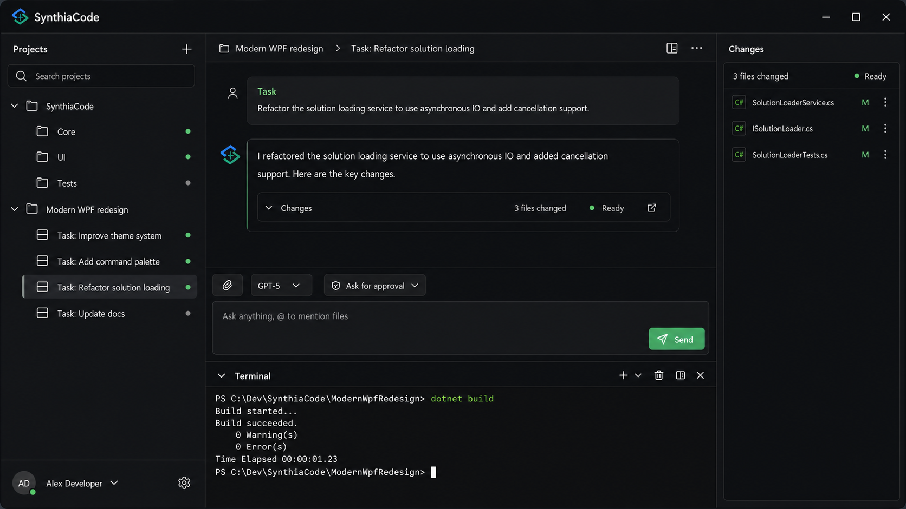

# Modern WPF UI Redesign Implementation Plan

Status: Approved visual direction; implementation pending  
Target: `SynthiaCode.App` on `net10.0-windows`  
Reference mockup: [`assets/design/modern-wpf-redesign-concept-graphite-v2.png`](assets/design/modern-wpf-redesign-concept-graphite-v2.png)



## 1. Objective

Redesign SynthiaCode as a cohesive, modern Windows developer tool while preserving its existing WPF, MVVM-style presentation architecture and all current Codex, project, thread, approval, terminal, Git, attachment, account, and persistence behavior.

The redesign should feel:

- focused rather than dashboard-like;
- dense enough for professional development work without feeling crowded;
- recognizably native to Windows 11;
- consistent across light and dark themes;
- responsive from the current 800 px minimum width through large desktop displays;
- fully usable with keyboard, screen reader, high contrast, and per-monitor DPI scaling;
- implementable with first-party WPF/XAML primitives and the existing application architecture.

This is a presentation redesign, not a rewrite of Core, Infrastructure, protocol handling, or task lifecycle behavior.

## 2. Experience target

The reference concept establishes the target information hierarchy:

1. A compact custom title bar identifies SynthiaCode and hosts true window controls.
2. A left project rail owns project and thread discovery.
3. The center workspace prioritizes the active conversation.
4. Model, reasoning, permission mode, attachments, and send behavior remain attached to the composer.
5. Terminal is a resizable lower dock instead of a disconnected full-page destination.
6. Changes and contextual status use an optional right inspector.
7. Account and settings remain anchored at the bottom of the project rail.
8. Neutral tonal contrast carries hierarchy and selection; strong color is reserved for keyboard focus, progress, status, and primary action.

The mockup is directional rather than pixel-authoritative. The implementation must favor working WPF behavior, accessibility, localization tolerance, and existing product semantics when those conflict with generated imagery.

The approved primary appearance is neutral graphite and charcoal. Application surfaces must not carry a navy or blue cast. The existing blue-to-teal SynthiaCode gradient may remain inside the brand mark, but it must not become a general-purpose interface accent. Selection uses neutral gray structure, while restrained emerald identifies the primary action and active focus.

## 3. Scope

### In scope

- visual design tokens and theme resources;
- application window chrome and shell layout;
- project/thread navigation;
- task transcript, activity presentation, and empty/loading/error states;
- composer, attachment affordances, run configuration, and permission affordances;
- terminal dock;
- changed-files inspector and details surfaces;
- approvals, menus, popups, tooltips, account flyout, and settings;
- icons, focus visuals, motion, keyboard discoverability, and accessibility;
- responsive states, DPI behavior, and persisted shell preferences;
- presentation tests, visual QA, and release documentation.

### Out of scope

- changing Codex app-server protocol behavior;
- changing approval or permission semantics;
- changing thread/worktree ownership rules;
- changing queued-follow-up persistence or dispatch rules;
- changing terminal process ownership or buffering;
- changing Git operations;
- adding a browser-rendered frontend or WebView2;
- adopting a third-party control suite;
- rebranding the existing SynthiaCode mark.

## 4. Non-negotiable behavioral guardrails

The following must remain intact throughout the redesign:

- `Ctrl+Enter` sends the primary composer action.
- `Ctrl+Shift+Enter` performs the alternate queue/steer action.
- `Ctrl+B`, `Ctrl+Shift+D`, `Ctrl+Shift+T`, and existing project/task shortcuts retain their behavior.
- Compact layout never leaves the project rail and inspector competing for unusable center width.
- Conversation virtualization and jump-to-latest behavior remain functional.
- Streaming updates do not cause full transcript re-layout or uncontrolled auto-scroll.
- Approvals remain modal in priority and cannot be obscured by drawers or popups.
- Permission choices remain fail-closed and use the existing resolver.
- Terminal output remains isolated per thread and bounded.
- Changed-file, account, model, reasoning, and rate-limit data retain their current sources of truth.
- Theme and shell preferences continue to round-trip through the current settings store.
- No redesign step broadens filesystem, command, network, authentication, or approval authority.

## 5. Design system

### 5.1 Foundation tokens

Move visual constants out of feature views and expose semantic resources. Use semantic names so light, dark, and high-contrast themes can share control templates.

Proposed resource groups:

| Group | Representative resources |
| --- | --- |
| Color | `AppCanvasBrush`, `SurfaceBrush`, `SurfaceRaisedBrush`, `SurfaceSunkenBrush`, `RailBrush`, `InspectorBrush` |
| Text | `TextPrimaryBrush`, `TextSecondaryBrush`, `TextTertiaryBrush`, `TextOnAccentBrush` |
| Border | `BorderSubtleBrush`, `BorderStrongBrush`, `FocusRingBrush`, `DividerBrush` |
| Accent | `ActionAccentBrush`, `ActionAccentHoverBrush`, `ActionAccentPressedBrush`, `ActionAccentSubtleBrush` |
| Status | `SuccessBrush`, `WarningBrush`, `DangerBrush`, `InfoBrush` and subtle counterparts |
| Typography | display, title, body, caption, metadata, code, and terminal styles |
| Spacing | 2, 4, 8, 12, 16, 20, 24, and 32 px values |
| Shape | 4, 8, 10, and 12 px corner radii |
| Control sizing | 28 px compact, 32 px standard, 36 px emphasized, 44 px touch-friendly |
| Motion | fast 80 ms, standard 140 ms, deliberate 200 ms; cubic ease-out |
| Elevation | border-only base surfaces and restrained shadows for flyouts/overlays |

Approved graphite dark palette:

| Role | Value |
| --- | --- |
| Canvas | `#0D0F12` |
| Rail | `#111318` |
| Surface | `#16191F` |
| Raised surface | `#1D2129` |
| Hover/selected surface | `#252A33` |
| Primary text | `#F1F3F5` |
| Secondary text | `#9DA5B1` |
| Subtle border | `#2C323C` |
| Neutral selection indicator | `#D4D8DE` |
| Primary action | `#18A77B` |
| Focus ring | `#45C997` |
| Success | `#3FB984` |
| Warning | `#D6A84B` |
| Error | `#E06C75` |

Color-use rules:

- Canvas, rail, panels, fields, menus, cards, and hover surfaces use neutral graphite values with no blue or purple tint.
- Selected navigation rows use `#252A33`, a thin `#D4D8DE` indicator, and an additional structural or typographic cue.
- Emerald is used sparingly for the primary action, active focus, progress, and other interactive emphasis. It is not a panel color.
- Success, warning, and error colors are reserved for their semantic states and must not be reused decoratively.
- The SynthiaCode logo may retain its original blue-to-teal gradient. Those brand colors are isolated to the mark and are not exposed as general control brushes.
- Shadows remain neutral black with low opacity; blue or colored glow effects are prohibited.

The graphite theme is the approved primary visual reference. The light palette should still be intentionally derived by semantic role, not by mechanically inverting dark values, so the existing theme capability and accessibility coverage remain intact.

### 5.2 Typography

- UI family: `Segoe UI Variable Text`, falling back to `Segoe UI`.
- Display/title family: `Segoe UI Variable Display`, falling back to the UI family.
- Code and terminal family: `Cascadia Mono`, falling back to `Consolas`.
- Default body size: 13–14 px depending on density and surface.
- Transcript body line height: approximately 1.5–1.6 times font size.
- Avoid using font weight alone to communicate selected or running state.
- Keep text rendering at native DPI; do not use bitmap scaling.

### 5.3 Iconography

- Build a small, audited `Geometry` resource set for common product actions.
- Use `Path`-based icons so color, DPI, disabled state, and high contrast follow theme resources.
- Standard visual sizes: 16 px inline, 18 px navigation, 20 px emphasized.
- Standard hit targets: at least 32 × 32 px even when the glyph is 16 px.
- Every icon-only button must have a tooltip, accessible name, and visible keyboard focus.
- Do not use Unicode punctuation or emoji as permanent control icons.

### 5.4 Motion

Motion should explain state changes, not decorate them:

- 80–140 ms color/opacity transitions for hover and press;
- 140–200 ms drawer and dock transitions;
- subtle progress shimmer only for indeterminate loading surfaces;
- no transcript item entrance animation while streaming;
- no animation that changes measured layout repeatedly;
- respect the Windows client-area animation preference and expose a no-motion fallback.

## 6. Target information architecture

```text
Application window
├── Custom title bar
│   ├── brand and workspace identity
│   ├── optional command/search entry
│   ├── connection indicator
│   └── native minimize/maximize/close behavior
├── Workspace shell
│   ├── Project rail
│   │   ├── Projects header and add action
│   │   ├── project/thread search
│   │   ├── virtualized project/thread tree
│   │   └── account/settings anchor
│   ├── Center workspace
│   │   ├── context header
│   │   ├── transcript
│   │   ├── composer
│   │   └── optional terminal dock
│   └── Inspector
│       ├── Changes
│       ├── task/details status
│       └── context-specific actions
├── Status/notification layer
└── Approval overlay
```

The existing Task, Terminal, Changes, and Settings feature boundaries remain useful, but their surfaces should be composed into the shell instead of relying on a visually dominant `TabControl`.

## 7. Responsive behavior

Use explicit layout states driven by available width. Keep the current 800 px minimum window width unless product requirements change.

| Available width | Project rail | Inspector | Terminal |
| --- | --- | --- | --- |
| 1440 px and above | 268–288 px, persistent | 320–360 px, persistent when enabled | resizable lower dock |
| 1100–1439 px | 248–268 px, persistent | overlay drawer or closed by default | resizable lower dock |
| 800–1099 px | overlay rail, one side surface at a time | overlay drawer | lower dock, capped near 45% height |

Rules:

- The center transcript should target a readable content measure around 760–900 px while allowing code and activity rows to expand.
- The composer always remains visible above an open terminal dock.
- Opening a compact rail closes the compact inspector, and vice versa.
- Drawers dismiss with `Esc`, clicking the scrim, navigation completion, or their toggle command.
- Drawer focus is contained while open and returns to the invoking control on close.
- Grid splitters expose keyboard resizing and minimum/maximum bounds.
- User-resized rail, inspector, and terminal dimensions should be persisted only after a short coalescing delay.

## 8. Implementation phases

### Phase 0 — Baseline and redesign contract

Goal: make the current behavior measurable before changing the visuals.

Work:

1. Record reference screenshots for light/dark themes at 800 × 640, 1100 × 720, 1320 × 800, 1600 × 1000, 125% DPI, and 200% DPI.
2. Record keyboard focus order for the shell, rail, transcript, composer, terminal, inspector, account flyout, and approval overlay.
3. Inventory hard-coded brushes, sizes, margins, corner radii, icon-like text, and duplicated templates.
4. Add a short presentation contract covering shortcuts, automation names, overlay priority, responsive exclusivity, and scroll behavior.
5. Confirm the complete behavioral suite is green before presentation changes.

Deliverables:

- baseline screenshot set stored outside production assets;
- resource/style inventory;
- explicit regression checklist;
- unchanged build and test results.

Exit criteria:

- every major surface has a baseline;
- critical automation names and shortcuts are documented;
- no known current behavioral failure is attributed to the redesign.

### Phase 1 — Resource architecture and design tokens

Goal: establish one semantic design system without changing page composition.

Work:

1. Reduce `App.xaml` to resource composition and application-wide wiring.
2. Introduce focused dictionaries, for example:
   - `Themes/Foundations.xaml`
   - `Themes/Typography.xaml`
   - `Themes/Icons.xaml`
   - `Themes/Controls.Buttons.xaml`
   - `Themes/Controls.Inputs.xaml`
   - `Themes/Controls.Navigation.xaml`
   - `Themes/Controls.Transient.xaml`
3. Replace existing color names with semantic aliases while retaining temporary compatibility aliases.
4. Rebuild the approved graphite dark palette and its light counterpart against the same semantic key set.
5. Add focus-ring, selection, validation, disabled, and status resources.
6. Add design-time fallback resources so isolated view previews do not fail.
7. Add a debug-only theme/resource validation routine or test that resolves every required key in both themes.

Exit criteria:

- switching themes does not recreate the window;
- every shared control resolves resources in graphite dark and light themes;
- feature views no longer introduce new literal colors;
- legacy resource aliases have an owner and removal phase.

### Phase 2 — Shared control primitives

Goal: make modern behavior reusable before rebuilding feature layouts.

Create or extract:

- `IconButton` style/control;
- primary, secondary, subtle, danger, and split-button variants;
- compact command bar;
- search box with clear action;
- status dot and status pill;
- navigation row;
- segmented workspace switcher where needed;
- modern `TextBox`, `ComboBox`, `ListBox`, `TreeView`, `TabItem`, `ScrollBar`, `Expander`, `GridSplitter`, `ContextMenu`, `ToolTip`, and `Popup` templates;
- empty, loading, inline-error, and unavailable-state presenters;
- `DrawerHost` or equivalent shell primitive;
- `PaneHeader` and `PaneSurface` styles;
- `FocusVisual` shared style.

Implementation notes:

- Use dependency properties only when a style plus attached property is insufficient.
- Prefer templated controls for reusable behavior and user controls for feature composition.
- Keep commands and state in existing view models.
- Avoid code-behind except for view-only behavior such as focus restoration, scroll thresholds, hit testing, and DPI/window integration.
- Validate mouse, keyboard, touchpad, and screen-reader behavior for each primitive before broad adoption.

Exit criteria:

- primitives render correctly at 100%, 125%, 150%, and 200% DPI;
- controls expose visual states for hover, press, focus, disabled, selected, error, and loading;
- no feature screen requires a local copy of a shared control template.

### Phase 3 — Window chrome and adaptive shell

Goal: replace the current stacked header/tab/status composition with the target shell.

Work:

1. Implement custom WPF `WindowChrome` while preserving resize borders, system menu, snap layout behavior where supported, double-click maximize, and correct caption hit testing.
2. Add a compact title bar with brand mark, current context, connection status, and real caption buttons.
3. Replace the visually dominant workspace tabs with shell-owned center, dock, and inspector regions.
4. Add project rail and inspector column states plus compact overlay states.
5. Add a resizable terminal row with a keyboard-accessible splitter.
6. Retain a subtle status/notification layer, moving persistent shortcuts into discoverable tooltips or a command/help surface.
7. Bind layout state to existing `MainViewModel` shell properties first; add only narrowly scoped persisted dimensions/state.
8. Ensure the approval overlay remains the topmost application-owned layer.

Likely files:

- `MainWindow.xaml`
- `MainWindow.xaml.cs`
- `ViewModels/MainViewModel.cs`
- `Themes/Controls.Navigation.xaml`
- new shell controls under `Controls/`
- settings snapshot/model files only for newly persisted dimensions

Exit criteria:

- window resize, drag, maximize, restore, snap, and DPI transitions work;
- compact rail/inspector exclusivity remains correct;
- terminal and composer remain reachable at minimum window size;
- all existing shell shortcuts remain functional.

### Phase 4 — Project and thread navigation

Goal: make project discovery fast and visually quiet.

Work:

1. Introduce the compact branded rail header and a clear Projects section header.
2. Present add/open project as an icon action with text alternative and tooltip.
3. Restyle project rows as disclosure groups with:
   - project name;
   - running/failure summary only when relevant;
   - contextual add and overflow actions;
   - a clear selected-project state.
4. Restyle thread rows with:
   - concise title;
   - selected accent bar;
   - running/error/archived state only when meaningful;
   - contextual actions through a consistent menu.
5. Add project/thread filtering if the existing search model can support it without protocol changes; otherwise stage the visual search affordance behind a disabled or omitted state until filtering is implemented.
6. Preserve virtualization and current routing behavior.
7. Keep the account row pinned below an independently scrolling navigation list.
8. Add useful empty states for no projects, no threads, and no search matches.

Likely files:

- `Views/ProjectThreadView.xaml`
- `Views/ProjectThreadView.xaml.cs`
- `ViewModels/ProjectThreadViewModel.cs`
- `ViewModels/ProjectNavigationItemViewModel.cs`
- `Views/UserAccountView.xaml`

Exit criteria:

- project/thread creation, selection, archive, fork, resume, and worktree actions retain their behavior;
- long names trim with accessible full-text tooltips;
- navigation remains usable with keyboard only;
- 500 or more presentation rows do not cause visible interaction stalls.

### Phase 5 — Conversation workspace

Goal: make the transcript the primary visual surface.

Work:

1. Replace nested heavy cards with a quiet content canvas and selectively bounded user, assistant, and activity surfaces.
2. Keep a readable central measure while allowing code blocks, long paths, tables, and activity detail to use available width.
3. Present each turn with clear user/assistant distinction without oversized role labels.
4. Convert activity to a compact disclosure row showing:
   - running/completed/failed state;
   - short summary;
   - count or duration when reliable;
   - full existing detail when expanded.
5. Preserve stable activity keys, consolidation, allowlisting, and chronological placement.
6. Restyle jump-to-latest as a small floating action above the composer.
7. Add polished states for:
   - new thread;
   - loading/restoring history;
   - reconnecting;
   - task running;
   - task failed or cancelled;
   - projectless thread;
   - empty assistant response with activity.
8. Restyle Markdown paragraphs, headings, lists, blockquotes, links, inline code, fenced code, and path links.
9. Add code-block chrome with language label and copy action if it can be added without compromising virtualization.
10. Avoid per-token animation or layout effects during streaming.

Likely files:

- `Views/TaskView.xaml`
- `Views/TaskView.xaml.cs`
- `Controls/MarkdownTextBlock.cs`
- `ViewModels/TaskViewModel.cs` only where presentation-specific state is missing

Exit criteria:

- streaming remains progressive and ordered;
- transcript virtualization remains enabled;
- manual scroll is not stolen;
- long Markdown and activity detail do not create horizontal page overflow;
- link security policy remains unchanged.

### Phase 6 — Composer, task configuration, and approvals

Goal: make task submission obvious while keeping powerful controls compact.

Work:

1. Build a bounded composer surface with:
   - attachment action;
   - multi-line prompt input;
   - selected model/reasoning summary;
   - selected permission mode;
   - primary run/send/queue/steer action;
   - alternate action when relevant;
   - queued follow-up summary.
2. Keep the prompt text area visually dominant over run configuration.
3. Use anchored flyouts for model, reasoning, service tier, and permission selection.
4. Preserve catalog-driven model/reasoning availability and disable changes during an active turn as today.
5. Show attachments as removable chips with type, name, validation state, and accessible action.
6. Keep paste, drag/drop, image input, file/folder attachment, and `@` mention behavior intact.
7. Restyle queued follow-ups as a compact, reorderable list immediately above the composer.
8. Redesign approval prompts as focused modal sheets:
   - concise request type and risk summary;
   - command/path/details in a monospaced region;
   - explicit allow once, allow for session, and decline hierarchy;
   - safe initial focus;
   - no approval by accidental default Enter.
9. Preserve exact approval response semantics and request invalidation behavior.

Likely files:

- `Views/TaskView.xaml`
- `Views/TaskView.xaml.cs`
- `Views/ApprovalPromptView.xaml`
- `Views/ApprovalPromptView.xaml.cs`
- `ViewModels/TaskViewModel.cs`
- `ViewModels/ApprovalQueueViewModel.cs`
- `ViewModels/ExecutionPolicyViewModel.cs`

Exit criteria:

- every current composer mode is visually distinguishable;
- action labels match first-turn, follow-up, queue, and steer semantics;
- attachment validation remains visible and actionable;
- approval focus cannot escape behind the modal;
- approval keyboard behavior has dedicated regressions.

### Phase 7 — Terminal dock and changes inspector

Goal: support coding flow without replacing the conversation.

Terminal:

1. Move Terminal into a lower center dock with open, collapse, maximize-within-workspace, clear, restart, and close actions.
2. Preserve per-thread session ownership and working-directory presentation.
3. Use a dark terminal surface in both app themes while maintaining accessible selection and caret contrast.
4. Provide a compact command input or preserve the current terminal interaction model without imitating a terminal emulator beyond its capabilities.
5. Persist dock visibility and a bounded height preference.
6. Cap the dock so the transcript and composer cannot be reduced below usable minimums.

Changes/inspector:

1. Make changed files the primary inspector view.
2. Show summary, file status, path, and contextual actions with clear selection.
3. Reuse the inspector for task metadata/details rather than duplicating another permanent column.
4. In compact mode, render the inspector as a modal-like drawer with focus management.
5. Preserve Git command and refresh behavior.

Likely files:

- `Views/TerminalView.xaml`
- `Views/TerminalView.xaml.cs`
- `ViewModels/TerminalViewModel.cs`
- `Views/GitView.xaml`
- `Views/GitView.xaml.cs`
- `ViewModels/GitViewModel.cs`
- `Views/DetailsView.xaml`
- `Views/DetailsView.xaml.cs`

Exit criteria:

- terminal output throughput and batching baselines do not regress materially;
- changing selected threads restores the correct terminal surface;
- file actions continue targeting the correct workspace;
- inspector state does not obscure approval prompts or compact navigation.

### Phase 8 — Account, settings, menus, and transient surfaces

Goal: ensure secondary UI matches the redesigned shell.

Work:

1. Restyle the account anchor and upward-opening account flyout.
2. Present plan, rate limits, credits, refresh/authentication, and settings with clear hierarchy.
3. Recompose settings into scan-friendly sections without changing the underlying values:
   - appearance;
   - task and follow-up behavior;
   - model defaults;
   - permissions;
   - diagnostics/advanced.
4. Standardize context menus, tooltips, combo popups, validation callouts, and confirmation dialogs.
5. Add consistent empty/loading/error states for account and catalog data.
6. Audit popup placement at screen edges and mixed-DPI monitor boundaries.
7. Ensure transient surfaces use the active theme and never fall back to default white WPF chrome in dark mode.

Likely files:

- `Views/UserAccountView.xaml`
- `Views/UserAccountView.xaml.cs`
- `Views/DetailsView.xaml`
- `Themes/TransientSurfaces.xaml`
- `Services/WpfUserInteractionService.cs`
- `Services/WpfThemeService.cs`

Exit criteria:

- all transient surfaces are theme-correct;
- flyouts close predictably and restore focus;
- account refresh/authentication behavior is unchanged;
- managed or unavailable settings remain visibly disabled with explanation.

### Phase 9 — Accessibility, high contrast, localization tolerance, and DPI

Goal: make accessibility a release gate rather than cleanup.

Work:

1. Add or verify automation names, help text, control types, and live-region behavior.
2. Test keyboard traversal, reverse traversal, logical groups, default/cancel actions, and focus restoration.
3. Ensure selected, running, warning, error, and disabled states never rely on color alone.
4. Ensure text and essential icons meet WCAG-inspired desktop contrast targets.
5. Add a high-contrast resource path or ensure templates correctly defer to system colors.
6. Verify 200% DPI and moving the window between monitors with different scaling.
7. Verify long project names, paths, translated-length labels, and 20% larger text.
8. Honor reduced-motion/system animation preferences.
9. Use screen-reader announcements sparingly for task completion, approval arrival, connection loss, and critical errors; do not announce streaming deltas continuously.

Exit criteria:

- all core flows are possible without a mouse;
- no focus indicator is clipped or hidden;
- no essential state is color-only;
- no major layout clips at 200% DPI or with expanded text;
- approval arrival and completion are announced without excessive noise.

### Phase 10 — Performance and regression hardening

Goal: prevent visual polish from weakening long-running desktop behavior.

Measure:

- cold shell-visible and ready times;
- theme-switch duration;
- layout/render cost during long streaming responses;
- transcript memory with bounded history;
- project navigation interaction with large lists;
- terminal append and presentation throughput;
- drawer/dock resize responsiveness;
- allocation rate during repetitive hover/selection;
- app shutdown with active task and terminal.

Rules:

- avoid `DropShadowEffect` on large scrolling surfaces;
- freeze reusable brushes, pens, and geometries where safe;
- preserve recycling virtualization and content scrolling;
- avoid binding converters in hot item templates when a trigger or precomputed presentation property is clearer;
- avoid `LayoutTransform` in scrolling content;
- do not animate width/height for large trees or transcripts;
- ensure event handlers are detached when views or popups close;
- keep UI-thread work out of stream and terminal hot paths.

Exit criteria:

- no material regression from documented startup, streaming, terminal, or shutdown baselines;
- no retained closed flyouts or view instances in a basic memory audit;
- all behavioral and presentation tests pass;
- solution builds with zero warnings and errors.

### Phase 11 — Visual QA and release

Goal: ship the redesign as a controlled, reviewable product change.

Work:

1. Capture the same viewport/DPI matrix used in Phase 0.
2. Compare each surface against the design principles and reference concept.
3. Test Windows 11 light/dark mode changes, high contrast, snap layouts, minimize/restore, sleep/resume, and reconnect.
4. Run keyboard-only walkthroughs for:
   - open project and select thread;
   - create and run a task;
   - attach files/folders/images;
   - queue and steer follow-ups;
   - answer approvals;
   - inspect changes;
   - open/use/close terminal;
   - change model and permission mode;
   - sign in/out and change theme.
5. Refresh portable build artifacts only after functional and visual gates pass.
6. Update README screenshots and architecture documentation.
7. Remove compatibility resource aliases and dead templates after all views migrate.

Release gate:

- behavior parity is confirmed;
- accessibility and DPI checks pass;
- visual review approves light and dark themes;
- performance remains within agreed bounds;
- no placeholder icons, generated-image UI assets, or mock-only text enter production.

## 9. File-level change map

| Area | Primary files | Expected change |
| --- | --- | --- |
| Resource composition | `App.xaml` | Merge focused dictionaries; remove large inline template collection |
| Theme palettes | `Themes/LightTheme.xaml`, `Themes/DarkTheme.xaml` | Semantic token parity and updated palette |
| Shared controls | new dictionaries under `Themes/` and controls under `Controls/` | Reusable styles, templates, icons, drawers, pane primitives |
| Shell | `MainWindow.xaml`, `MainWindow.xaml.cs` | Custom chrome, three-zone layout, terminal dock, overlay hosting |
| Navigation | `Views/ProjectThreadView.*`, `Views/UserAccountView.*` | Modern rail, selection, search/empty states, account anchor |
| Task | `Views/TaskView.*`, `Controls/MarkdownTextBlock.cs` | Transcript, activity, Markdown, composer, queues |
| Approval | `Views/ApprovalPromptView.*` | Accessible modal presentation |
| Terminal | `Views/TerminalView.*` | Resizable dock presentation |
| Git/inspector | `Views/GitView.*`, `Views/DetailsView.*` | Inspector composition and compact drawer |
| Presentation state | relevant files under `ViewModels/` | Only narrowly scoped layout/presentation state |
| Theme behavior | `Services/WpfThemeService.cs` | Theme dictionary orchestration and system preference handling |
| Tests | `SynthiaCode.Tests` presentation and responsive suites | Resource, layout, focus, automation, behavior, and performance regressions |
| Docs | `README.md`, `docs/current-architecture.md` | Updated screenshots and presentation architecture |

## 10. Test strategy

### Resource tests

- Every required semantic resource resolves in light and dark themes.
- The graphite dark theme exposes no blue-tinted interface brush; the logo asset is the only approved blue-to-teal exception.
- Shared control templates resolve without fallback system chrome.
- No literal production brush values appear in feature views except documented one-off assets.
- Every icon-only button has tooltip and automation name.

### Layout tests

- Wide shell shows configured persistent surfaces.
- Medium shell converts inspector to drawer.
- Compact shell allows only one side drawer.
- Composer remains visible at minimum supported size.
- Terminal dock respects min/max constraints.
- Long titles and paths trim or wrap without moving essential actions offscreen.

### Interaction tests

- Existing shortcuts execute the same commands.
- `Esc` closes the topmost dismissible surface in the correct order.
- Flyout/drawer focus returns to its invoker.
- Approval overlay traps focus and remains above all shell surfaces.
- Splitters resize with pointer and keyboard.
- Theme switching preserves selection, scroll context, draft text, and active task state.

### Accessibility tests

- Logical tab order for every major surface.
- Automation properties for navigation, composer, status, approvals, terminal, and inspector.
- Selected/running/error states have non-color cues.
- High-contrast resources remain legible.
- Completion, approval, and disconnect announcements are useful but not noisy.

### Performance tests

- Theme switch does not rebuild feature view models.
- Streaming and terminal update batching retain current bounds.
- Large navigation and transcript collections remain virtualized.
- Repeated drawer/popup use does not retain closed surfaces.
- Resizing does not trigger repeated persistence writes.

### Visual QA matrix

| Theme | Width × height | DPI | Required surfaces |
| --- | --- | --- | --- |
| Graphite dark | 800 × 640 | 100% | compact rail, composer, terminal |
| Graphite dark | 1320 × 800 | 125% | rail, transcript, dock, inspector |
| Graphite dark | 1600 × 1000 | 200% | all surfaces, large text |
| Light | 800 × 640 | 100% | compact rail, approval |
| Light | 1320 × 800 | 125% | standard working state |
| High contrast | 1320 × 800 | 100% | navigation, composer, approval, menus |

## 11. Recommended implementation order

Use small pull-request or commit-sized slices:

1. Baseline contract and tests.
2. Semantic tokens and palette parity.
3. Shared buttons, inputs, icons, focus visuals, and transient controls.
4. Window chrome and adaptive shell.
5. Project rail and account anchor.
6. Transcript and Markdown styling.
7. Composer and task configuration.
8. Approval overlay.
9. Terminal dock.
10. Changes/details inspector.
11. Settings and remaining transient surfaces.
12. Accessibility, DPI, motion, performance, and final cleanup.

Each slice should build and pass the narrow presentation suite before the next feature migrates. Compatibility aliases may bridge slices, but must be removed in the final cleanup.

## 12. Definition of done

The redesign is complete when:

- the running WPF app reflects the reference concept's hierarchy and visual language;
- the default dark appearance uses the approved neutral graphite palette without blue-tinted surfaces or controls;
- selection remains legible through neutral structure, and emerald is limited to intentional interaction and status roles;
- all major surfaces share one semantic design system;
- both themes are intentionally designed and complete;
- wide, medium, and compact layouts behave predictably;
- all existing behavior and safety semantics are preserved;
- core workflows are fully keyboard accessible;
- high contrast, screen reader basics, and mixed-DPI behavior pass;
- streaming, terminal, navigation, startup, and shutdown performance remain within agreed bounds;
- all tests pass and the solution builds without warnings;
- README and architecture documentation reflect the shipped interface;
- the generated concept remains a design reference only and is not loaded as production UI.

## Appendix A — Approved mockup generation record

Mode: built-in image generation, image edit  
Use case: `precise-object-edit`  
Output: `assets/design/modern-wpf-redesign-concept-graphite-v2.png`  
Input 1: `assets/design/modern-wpf-redesign-concept-v1.png` as the edit target  
Input 2: `assets/branding/synthiacode-logo-concept-v1.png` as a supporting brand reference

```text
Use case: precise-object-edit
Asset type: revised full-resolution high-fidelity desktop WPF UI mockup
Input images: Image 1 is the edit target and authoritative source for layout, geometry, content, spacing, and text. Image 2 is a supporting brand reference for the SynthiaCode mark only.
Primary request: Change only the visual color system of Image 1 from blue/navy-heavy styling to a sophisticated neutral graphite/charcoal dark scheme.
Color palette: application canvas #0D0F12; navigation rail #111318; main surfaces #16191F; raised surfaces #1D2129; hover/selected surfaces #252A33; borders #2C323C; primary text #F1F3F5; secondary text #9DA5B1; neutral selection indicator #D4D8DE; primary action and active accent #18A77B; success #3FB984; warning #D6A84B; error #E06C75. Surfaces must read as neutral charcoal gray with no navy or blue cast.
Theme behavior: Remove blue from backgrounds, borders, input focus surfaces, selected rows, header cards, and buttons. Use tonal graphite contrast for hierarchy. Use a thin light-gray selection bar and subtle charcoal selection fill. Use emerald sparingly for the Send button, active focus outline, progress, and positive statuses. The SynthiaCode logo mark may retain its original blue-to-teal brand gradient, but no other interface element should use blue.
Lighting/mood: restrained, premium, calm developer workspace; crisp accessible contrast; low-glare dark mode.
Text: Preserve every visible word, path, filename, label, number, icon, and punctuation from Image 1 exactly. Do not rewrite, add, remove, or garble text.
Constraints: Change only the color theme and corresponding tonal shadows/highlights. Preserve the exact 16:9 straight-on application framing, pixel layout, panel dimensions, title bar, navigation hierarchy, conversation content, composer controls, terminal, right inspector, typography sizes, spacing, corner radii, icons, and all existing UI content from Image 1. Keep all UI realistically implementable in WPF/XAML. Preserve sharp full-resolution rendering. No watermark.
Avoid: navy tint, blue panels, blue outlines, blue selection fills, blue buttons, cyan glow, neon cyberpunk, purple, excessive gradients, glassmorphism, bloom, altered layout, new widgets, removed widgets, marketing styling, perspective distortion.
```
